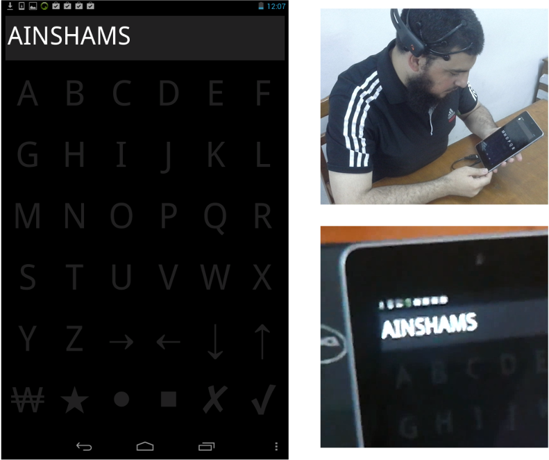

# README

This repository contains QT C++ / C++ code for an Android P300 speller application called "MindEdit". The application is a simple text editor that uses EEG recording. The code includes implementation of machine learning methods used for the classification of P300 patterns in the EEG signals. The interface of the application is shown in the following figure.

This code is based on the following paper:

[MindEdit: A P300-based text editor for mobile devices](https://www.sciencedirect.com/science/article/abs/pii/S0010482516303092)

Please, cite the following papers if you used this code:

1. Elsawy, Amr S., et al. "MindEdit: A P300-based text editor for mobile devices." Computers in biology and medicine 80 (2017): 97-106.

2. Elsawy, Amr S., et al. "A principal component analysis ensemble classifier for P300 speller applications." 2013 8th International Symposium on Image and Signal Processing and Analysis (ISPA). IEEE, 2013.

3. Elsawy, Amr S., et al. "Performance analysis of a Principal Component Analysis ensemble classifier for Emotiv headset P300 spellers." 2014 36th Annual International Conference of the IEEE Engineering in Medicine and Biology Society. IEEE, 2014.